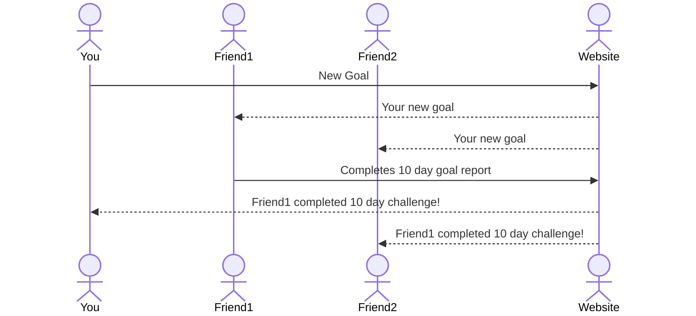

# ConsistAndSee

[My Notes](notes.md)

ConsistAndSee is an application that will allow you to start and track new goals. The difference between this and every other application is you can add friends, and be notified of each others' milestones (hitting 10 days, starting a new goal, completing a challenge, etc.) I don't believe a new goal is going to fix everything, but I believe the ability to be consistent in some things will. The programming and options for goal tracking and progress will encourage consistency, not perfection, and improve the journey, not just the ending.

## 🚀 Specification Deliverable

For this deliverable I did the following. I checked the box `[x]` and added a description for things I completed.

- [x] Proper use of Markdown
- [x] A concise and compelling elevator pitch
- [x] Description of key features
- [x] Description of how you will use each technology
- [x] One or more rough sketches of your application. Images must be embedded in this file using Markdown image references.

### Elevator pitch

Aren't you tired of setting a new goal that you're so excited about, only to see it fall flat in a matter of days? Aren't you tired of social media soaking up so much of your time as you mindlessly scroll? What you need is ConsistAndSee, an app designed to track your most important daily goals in an easy-to-manage setup for you, and share them with your friends, to increase your accountability, and support received from your community. This is the social media that will lead you to a productive life as we all celebrate consistency, and as you champion YOUR goals, you will also champion yourself. Develop the habits you wish your life to _consist_ of, _and see_ the results!

### Design

### Key features

- Goal-setting prompts
- A username and password login to keep your account privacy and personalization
- View of a feed of others' goals and progress
- Personal view of goals past and present
- Ability to create your own goals and share
- Ability to comment on others' goals/achievements
- Abililty to self-evaluate when a goal is not reached
- Feed specified for one goal for all updates, pictures, and comments attributed to it
- Goals and greater details are stored and displayed on personal profile

### Technologies

I am going to use the required technologies in the following ways.

- **HTML** - Three different HTML pages, with basic structure of website. First page - Login, Second Page - Personal profile (individual goal monitoring, maybe another page), Third page - friends' feed. This will have a simple design, so not very complex HTML
- **CSS** - I will use this to make the pages more exciting and artistic. The main use of CSS will be to add style to the client profile, and the feed, but fun features that I need CSS for include adding different colors or emoji's (like a fire) when you reach a new milestone. I also want to make sure the website adapts well to different screen sizes
- **React** - Provides login, rendering of current goals, sharing the root client's progress with others and vice versa
- **Service** - Backend service with endpoints for:
    - Creating a new goal (and choosing the type)
    - Storing ID's of your friends (to notify and display on their feed, and vice versa)
    - Changing the description or terms of a goal
    - Login
- **DB/Login** - Store users, friends of each user, a user's goals (in progress, completed, and abandoned). Register and login users. Requires authentication to do service actions, credentials safely stored in database
- **WebSocket** - As a user reaches a new milestone, that milestone is broadcasted to all other friends

## 🚀 AWS deliverable

For this deliverable I did the following. I checked the box `[x]` and added a description for things I completed.

- [x] **Server deployed and accessible with custom domain name** - [My server link](https://yourdomainnamehere.click).

## 🚀 HTML deliverable

For this deliverable I did the following. I checked the box `[x]` and added a description for things I completed.

- [x] **HTML pages** - Apart from index.html, I created 4 HTML pages - create.html, review.html, report.html, and about.html
- [x] **Proper HTML element usage** - I used and HTML form, and body, and buttons, and columns and all that in HTML
- [x] **Links** - My github links are clearly displayed at the bottom of every page
- [x] **Text** - On the about page, I embedded text with HTML to describe the website use
- [x] **3rd party API placeholder** - You can see on the review page a placeholder for someone who has a habit to read 15 minutes each day 
- [x] **Images** - You will see an image embedded in the bubble on google chrome, and on the about page
- [x] **Login placeholder** - You can see this on the Index.HTML main page
- [x] **DB data placeholder** - When you submit a new habit on the create page it submits that information to a database
- [x] **WebSocket placeholder** - You will be notified on the review page every time you hit a significant milestone

## 🚀 CSS deliverable

For this deliverable I did the following. I checked the box `[x]` and added a description for things I completed.

- [x] **Header, footer, and main content body** - Main menu in header, body in body, and github link in footer
- [x] **Navigation elements** - Main menu links will take you to other pages of the site
- [x] **Responsive to window resizing** - Used flex to adjust main menu when window shrinks
- [x] **Application elements** - You can see the nice coloring and font I added to the webpage. Makes it more fun to look at
- [x] **Application text content** - I altered fonts and spaces bewteen text, makes it much more fun to read, and easy too. Also the font of a menu item changes when you are currently on that page
- [x] **Application images** - Image is embedded and centered on the screen on the about page

## 🚀 React part 1: Routing deliverable

For this deliverable I did the following. I checked the box `[x]` and added a description for things I completed.

- [x] **Bundled using Vite** - I installed vite and by running "npm run dev" I call vite to bundle up everything
- [x] **Components** - You can see that I have injected my main html from each page and my header and footer html into the react components. I have the header and footer components in app.jsx, then my router puts in the body of my page depending on which page I'm on
- [x] **Router** - In my app.jsx file, I used the browser router in place of a main section to route between my pages. Do can see this by navigating to a page then seeing in the url that it says "/create" instead of "/create.html"

## 🚀 React part 2: Reactivity

For this deliverable I did the following. I checked the box `[x]` and added a description for things I completed.

- [x] **All functionality implemented or mocked out** - You can now create a habit, review its progress, and report on the habit (only once per day (completing the habit adds one day, failing removes 2))
- [x] **Hooks** - I used useState to implement reactivity on my create, login, review, and report components. The useState helped me update habits, and using useEffect helped me implement functions, like pulling the habit array from local storage, before rendering HTML

## 🚀 Service deliverable

For this deliverable I did the following. I checked the box `[x]` and added a description for things I completed.

- [x] **Node.js/Express HTTP service** - Used this, especially for help with endpoints
- [x] **Static middleware for frontend** - Used middleware to call routers in service layer
- [x] **Calls to third party endpoints** - Used this to generate a quote in the about page (It pops up in the white space at the bottom... I'm still working on making that page pretty)
- [x] **Backend service endpoints** - Used backend endpoints to access information stored on the server.
- [x] **Frontend calls service endpoints** - Yes. You will see several calls to endpoints wehre there used to be functions to access from local storage.

## 🚀 DB/Login deliverable

For this deliverable I did the following. I checked the box `[x]` and added a description for things I completed.

- [x] **User registration** - Registering makes a new entry in mongo
- [x] **User login and logout** - Login and logout possible by accessing mongo.
- [x] **Stores data in MongoDB** - All of it is in Mongo.
- [x] **Stores credentials in MongoDB** - Checks mongo for habits.
- [x] **Restricts functionality based on authentication** - Checks mongo for authToken.
(If you go to my index.js file in the service folder, you'll see many calls to my data access methods.
You can see those methods in the database.js file also in the same service folder)

## 🚀 WebSocket deliverable

For this deliverable I did the following. I checked the box `[x]` and added a description for things I completed.

- [ ] **Backend listens for WebSocket connection** - I did not complete this part of the deliverable.
- [ ] **Frontend makes WebSocket connection** - I did not complete this part of the deliverable.
- [ ] **Data sent over WebSocket connection** - I did not complete this part of the deliverable.
- [ ] **WebSocket data displayed** - I did not complete this part of the deliverable.
- [ ] **Application is fully functional** - I did not complete this part of the deliverable.
