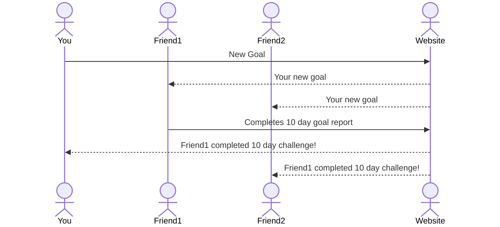

# ConsistAndSee

[My Notes](notes.md)

ConsistAndSee is an application that will allow you to start and track new goals. The difference between this and every other application is you can add friends, and be notified of each others' milestones (hitting 10 days, starting a new goal, completing a challenge, etc.) I don't believe a new goal is going to fix everything, but I believe the ability to be consistent in some things will. The programming and options for goal tracking and progress will encourage consistency, not perfection, and improve the journey, not just the ending.

## 🚀 Specification Deliverable

For this deliverable I did the following. I checked the box `[x]` and added a description for things I completed.

- [x] Proper use of Markdown
- [x] A concise and compelling elevator pitch
- [x] Description of key features
- [x] Description of how you will use each technology
- [x] One or more rough sketches of your application. Images must be embedded in this file using Markdown image references.

### Elevator pitch

Aren't you tired of setting a new goal that you're so excited about, only to see it fall flat in a matter of days? Aren't you tired of social media soaking up so much of your time as you mindlessly scroll? What you need is ConsistAndSee, an app designed to track your most important daily goals in an easy-to-manage setup for you, and share them with your friends, to increase your accountability, and support received from your community. This is the social media that will lead you to a productive life as we all celebrate consistency, and as you champion YOUR goals, you will also champion yourself. Develop the habits you wish your life to _consist_ of, _and see_ the results!

### Design

### Key features

- Goal-setting prompts
- A username and password login to keep your account privacy and personalization
- View of a feed of others' goals and progress
- Personal view of goals past and present
- Ability to create your own goals and share
- Ability to comment on others' goals/achievements
- Abililty to self-evaluate when a goal is not reached
- Feed specified for one goal for all updates, pictures, and comments attributed to it
- Goals and greater details are stored and displayed on personal profile

### Technologies

I am going to use the required technologies in the following ways.

- **HTML** - Three different HTML pages, with basic structure of website. First page - Login, Second Page - Personal profile (individual goal monitoring, maybe another page), Third page - friends' feed. This will have a simple design, so not very complex HTML
- **CSS** - I will use this to make the pages more exciting and artistic. The main use of CSS will be to add style to the client profile, and the feed, but fun features that I need CSS for include adding different colors or emoji's (like a fire) when you reach a new milestone. I also want to make sure the website adapts well to different screen sizes
- **React** - Provides login, rendering of current goals, sharing the root client's progress with others and vice versa
- **Service** - Backend service with endpoints for:
    - Creating a new goal (and choosing the type)
    - Storing ID's of your friends (to notify and display on their feed, and vice versa)
    - Changing the description or terms of a goal
    - Login
- **DB/Login** - Store users, friends of each user, a user's goals (in progress, completed, and abandoned). Register and login users. Requires authentication to do service actions, credentials safely stored in database
- **WebSocket** - As a user reaches a new milestone, that milestone is broadcasted to all other friends

## 🚀 AWS deliverable

For this deliverable I did the following. I checked the box `[x]` and added a description for things I completed.

- [ ] **Server deployed and accessible with custom domain name** - [My server link](https://yourdomainnamehere.click).

## 🚀 HTML deliverable

For this deliverable I did the following. I checked the box `[x]` and added a description for things I completed.

- [ ] **HTML pages** - I did not complete this part of the deliverable.
- [ ] **Proper HTML element usage** - I did not complete this part of the deliverable.
- [ ] **Links** - I did not complete this part of the deliverable.
- [ ] **Text** - I did not complete this part of the deliverable.
- [ ] **3rd party API placeholder** - I did not complete this part of the deliverable.
- [ ] **Images** - I did not complete this part of the deliverable.
- [ ] **Login placeholder** - I did not complete this part of the deliverable.
- [ ] **DB data placeholder** - I did not complete this part of the deliverable.
- [ ] **WebSocket placeholder** - I did not complete this part of the deliverable.

## 🚀 CSS deliverable

For this deliverable I did the following. I checked the box `[x]` and added a description for things I completed.

- [ ] **Header, footer, and main content body** - I did not complete this part of the deliverable.
- [ ] **Navigation elements** - I did not complete this part of the deliverable.
- [ ] **Responsive to window resizing** - I did not complete this part of the deliverable.
- [ ] **Application elements** - I did not complete this part of the deliverable.
- [ ] **Application text content** - I did not complete this part of the deliverable.
- [ ] **Application images** - I did not complete this part of the deliverable.

## 🚀 React part 1: Routing deliverable

For this deliverable I did the following. I checked the box `[x]` and added a description for things I completed.

- [ ] **Bundled using Vite** - I did not complete this part of the deliverable.
- [ ] **Components** - I did not complete this part of the deliverable.
- [ ] **Router** - Routing between login and voting components.

## 🚀 React part 2: Reactivity

For this deliverable I did the following. I checked the box `[x]` and added a description for things I completed.

- [ ] **All functionality implemented or mocked out** - I did not complete this part of the deliverable.
- [ ] **Hooks** - I did not complete this part of the deliverable.

## 🚀 Service deliverable

For this deliverable I did the following. I checked the box `[x]` and added a description for things I completed.

- [ ] **Node.js/Express HTTP service** - I did not complete this part of the deliverable.
- [ ] **Static middleware for frontend** - I did not complete this part of the deliverable.
- [ ] **Calls to third party endpoints** - I did not complete this part of the deliverable.
- [ ] **Backend service endpoints** - I did not complete this part of the deliverable.
- [ ] **Frontend calls service endpoints** - I did not complete this part of the deliverable.

## 🚀 DB/Login deliverable

For this deliverable I did the following. I checked the box `[x]` and added a description for things I completed.

- [ ] **User registration** - I did not complete this part of the deliverable.
- [ ] **User login and logout** - I did not complete this part of the deliverable.
- [ ] **Stores data in MongoDB** - I did not complete this part of the deliverable.
- [ ] **Stores credentials in MongoDB** - I did not complete this part of the deliverable.
- [ ] **Restricts functionality based on authentication** - I did not complete this part of the deliverable.

## 🚀 WebSocket deliverable

For this deliverable I did the following. I checked the box `[x]` and added a description for things I completed.

- [ ] **Backend listens for WebSocket connection** - I did not complete this part of the deliverable.
- [ ] **Frontend makes WebSocket connection** - I did not complete this part of the deliverable.
- [ ] **Data sent over WebSocket connection** - I did not complete this part of the deliverable.
- [ ] **WebSocket data displayed** - I did not complete this part of the deliverable.
- [ ] **Application is fully functional** - I did not complete this part of the deliverable.
